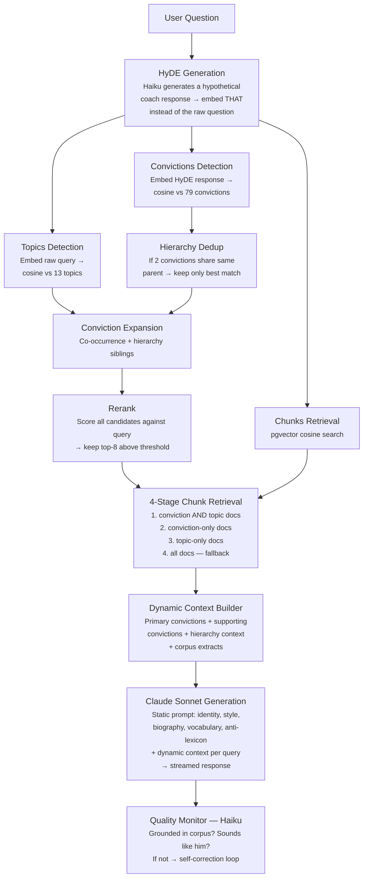
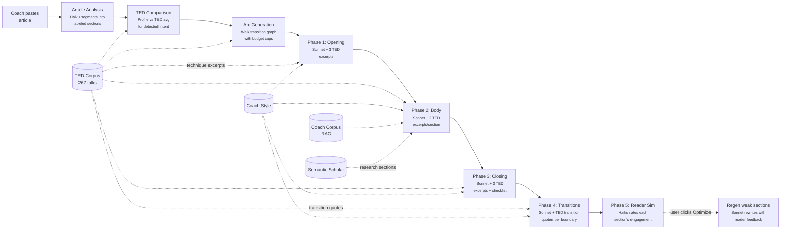
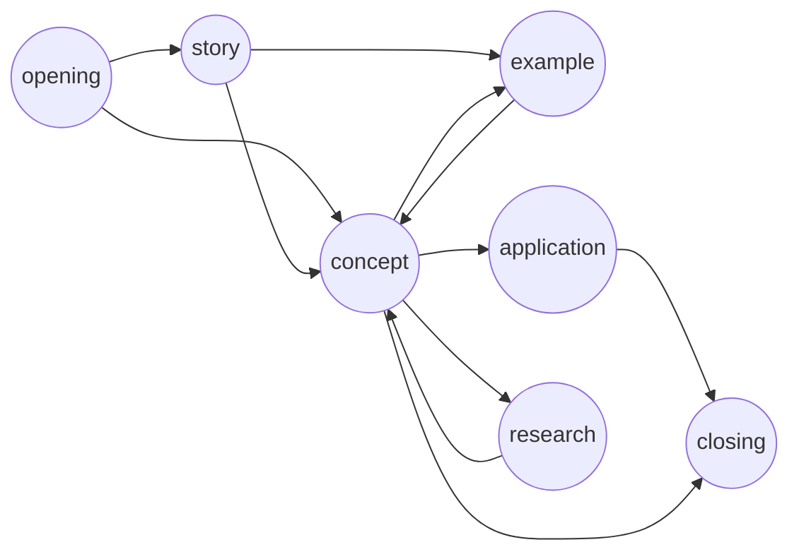
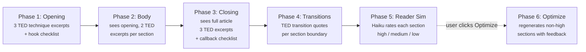
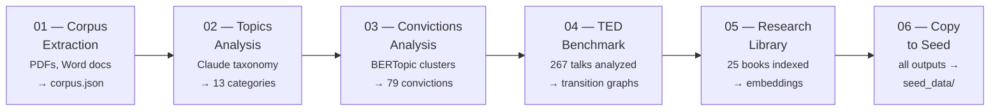

# Structure Corpus

An AI-powered analysis pipeline and web application that maps the intellectual universe of a coaching practice. Starting from a corpus of 918 documents (articles, video transcripts, training materials, and book extracts — ~792k words), it discovers topics, extracts core convictions through unsupervised clustering, and deploys an interactive exploration platform with a RAG-powered coaching chatbot and a TED-inspired article rewriting engine.

## The Problem With Standard RAG

A typical RAG chatbot retrieves text chunks similar to the user's question and feeds them to an LLM. This works when the corpus covers the exact topic being asked about. But a coach's value isn't in their content — it's in their *perspective*. When someone asks about a topic the coach never explicitly wrote about, a standard RAG system has nothing to retrieve and falls silent.

## The Approach

This project adds a structural layer between the raw corpus and the chatbot. Starting from 918 documents across four source types (482 articles, 280 video transcripts, 116 training modules, 40 book extracts — 792k words), the pipeline:

1. **Discovers topic categories** via Claude-driven taxonomy (what the coach talks *about*)
2. **Extracts 79 core convictions** via unsupervised clustering with BERTopic (what the coach *believes*)
3. **Builds a conviction hierarchy** — grouping related convictions into branches of deeper beliefs
4. **Maps co-occurrence patterns** — which convictions the coach naturally connects when writing
5. **Benchmarks against TED talks** — extracts structural patterns from 267 TED presentations to power article rewriting

The convictions are the coach's transferable reasoning patterns. The hierarchy and co-occurrence graph are what make the chatbot generalize: when a user asks about any topic, the system identifies which specific convictions apply, what deeper beliefs they stem from, and what adjacent opinions the coach would naturally bring up.

## RAG Architecture



### Key Design Decisions

- **79 convictions, not 15.** The full granularity of the coach's thinking is preserved. The hierarchy provides navigation, not reduction.
- **HyDE bridges the language gap.** Users ask "comment gérer un collègue difficile?" but the coach's conviction is about "colère réprimée." HyDE translates user language into coach language before retrieval.
- **Hierarchy deduplication.** Near-duplicate convictions (same topic, different angle) don't waste retrieval slots. Only the best match per branch is kept.
- **4-stage chunk retrieval.** Conviction AND topic intersection gives the tightest filter. Cascading fallbacks ensure we always find relevant text.
- **Static prompt is compact.** 79 conviction labels (~200 tokens), not 79 full descriptions (~4000 tokens). Full descriptions are injected only for the 3-8 relevant ones per query.

## TED-Powered Article Rewriting

The **Réécriture** page restructures the coach's articles using structural patterns learned from 267 TED talks. The goal is not to replace the coach's words, but to reorganize his content into a more engaging structure — the kind that makes the best TED talks work.



### How It Works

#### 1. Article Analysis

Claude segments the article into structural sections, each tagged with:
- A **label** (what the section IS): `opening`, `story`, `example`, `analogy`, `concept`, `research`, `objection`, `interaction`, `application`, `closing`
- A **purpose** (what the section DOES to the reader): `creates_curiosity`, `builds_tension`, `delivers_insight`, `creates_empathy`, `reframes`, `anchors_memory`, etc.
- An **intent** for the whole article: `teach_method`, `challenge_belief`, `share_discovery`, `inspire_change`, `tell_journey`, `explain_phenomenon`, `raise_awareness`

#### 2. TED Comparison

The article's structural profile (% of word count per label) is compared against the TED average for its detected intent:
- **Missing**: "TED talks with this intent use `story` 13% of the time — your article has none"
- **Under-represented**: "Your `application` section is 5% vs. TED's 15%"
- **Over-represented**: "Your `concept` is 62% vs. TED's 30%"

#### 3. Arc Generation

A suggested arc is generated by walking the **TED transition graph** — a weighted directed graph built from all 267 analyzed talks, where nodes are section labels and edges are "after X, Y follows Z% of the time."


<small>Simplified view — the real graph has 10 nodes, 14 transition types, and per-intent variants.</small>

The walk is constrained by three forces:

**1. Intent-specific transition probabilities** — a `challenge_belief` talk has different transitions than a `teach_method` talk. The graph used for the walk is filtered to only include patterns from talks with the same intent. For example, `challenge_belief` talks go from `story` to `concept` 40% of the time, while `teach_method` talks go from `story` to `application` 35% of the time.

**2. TED budget caps** — each label gets a maximum percentage budget derived from TED averages for that intent (e.g., `concept` = 30%, `story` = 13%). Once a label's budget is consumed, the walker skips it. All step percentages sum to 100%, ensuring realistic proportions.

**3. Content-aware scoring** — at each step, candidates are scored by: `transition_probability × content_bonus × repetition_penalty`
  - `content_bonus = 1.0 + article_profile[label] × 2.0` — labels the article already contains get a boost, so the arc prefers paths that use existing material. An article with 30% story will naturally get story in the arc.
  - `repetition_penalty = 1 / (1 + times_used)` — discourages using the same label too many times.
  - If TED patterns strongly favor a label the article is missing (e.g., `concept` at 40% transition probability vs `research` at 10%), the missing label still gets selected — because the arc reflects what makes TED talks work, not just what the article already has. The gap analysis surfaces these differences explicitly.

#### 4. Section-by-Section Rewrite

The article is rewritten in **6 phases** — each a separate API call with a focused job:



**Phase 1 — Opening**: generates only the hook with 3 TED technique excerpts and a checklist (grab in first sentence, create open loop, stay short). If the original opening is already strong, keeps it.

**Phase 2 — Body**: receives the opening as context. Restructures the middle sections following the arc, with 2 TED excerpts per section. For `research` sections, the coach's reference library is searched for relevant passages (see Research Library below).

**Phase 3 — Closing**: receives the full article so far and can literally read the opening to callback to it. Mandatory triple checklist: callback to opening, concrete takeaway, memorable anchor phrase.

**Phase 4 — Transitions**: the critical glue pass. For each section boundary (e.g., `story → concept`, `example → application`), the system looks up the **TED transition examples index** — real transition sentences from TED talks with the same intent and label pair. The AI receives these as technique examples and adds/improves only the bridging sentences between sections, without touching section content. This is what turns a sequence of good-but-disconnected sections into a flowing article.

**Phase 5 — Reader Simulation**: Haiku reads the complete article as a first-time reader and rates each section's engagement (`high`, `medium`, `low`). For non-high sections, it explains the issue and suggests a fix. Results are shown inline in the arc display in the analysis panel.

**Phase 6 — Optimize** (user-triggered): the coach reviews the reader simulation results and clicks "Optimiser" to regenerate non-high sections. Only the weak sections are regenerated — high sections are preserved untouched. Each regeneration prompt includes the reader's specific feedback. After optimization, only the regenerated sections are re-evaluated.

Each section prompt includes **real TED transcript excerpts** matching the same intent + label + purpose. These are technique demonstrations — the AI studies HOW the TED speaker achieves the section's purpose and applies the same rhetorical technique to the coach's content:

- PURPOSE `anchors_memory` + TED excerpt uses a callback → the closing must callback to the opening
- PURPOSE `creates_curiosity` + TED excerpt poses a confession → reframe the opening as a confession
- PURPOSE `delivers_insight` + TED excerpt builds up then drops a one-liner → same build-up/punch structure

Key rules:
- **Purpose first**: each section must achieve its stated purpose effectively, using the coach's material and voice
- **Sound like the coach, not like an AI**: no em dashes (—), no corporate buzzwords, no framework references (PCM, AT) unless the original article uses them
- **Invented content is flagged**: wrapped in `⚠️ [SUGGESTION — à adapter] ... ⚠️`
- **Diff highlighting**: yellow for added content, red strikethrough for lost content
- **Title rewriting**: when provided, the title is improved using patterns from top TED talk titles for the detected intent
- **Research from the coach's library**: for `research` sections, passages are retrieved from the coach's own reference books (see below)

### Research Library

When the suggested arc includes a `research` section, the rewrite engine searches the coach's **own bookshelf** — not the internet.


The library is built from 25 books the coach actually reads and cites: Cal Newport (Deep Work, Slow Productivity), Daniel Goleman (Emotional Intelligence), Robert Cialdini (Psychology of Persuasion), James Clear (Atomic Habits), Eric Berne (Games People Play), Susan Cain (Quiet), Simon Sinek (Start With Why), and others.

**Why not academic papers?** The coach doesn't cite academic journals — he cites books. "Cal Newport montre que..." is 100x more credible in his voice than "une étude de Smith et al. (2019)...". The library matches his actual citation style.

**Pipeline** (notebook 05):
1. Extract text from PDFs in `src/data/research/`
2. Chunk into ~500-word passages with 50-word overlap
3. Embed via HuggingFace Inference API (same model as main corpus)
4. Save as `research_library.json` + `research_embeddings.npy`

| File | Description |
|------|-------------|
| `research_library.json` | ~3k chunks with author, title, text, word_count |
| `research_embeddings.npy` | 384-dim vectors for cosine search |

### TED Structure Data

| File | Description |
|------|-------------|
| `ted_structures.json` | 267 talks with intent, sections (label, purpose, transition, word_count), label_profile |
| `ted_transition_graphs.json` | Weighted directed graphs per intent (label → label with probabilities) |
| `ted_section_excerpts.json` | Transcript excerpts indexed by intent/label/purpose (516 combos, top 5 by views) |
| `ted_transition_examples.json` | Real transition quotes indexed by intent/from_label/to_label (397 combos, top 5 by views) — used in Phase 4 |
| `ted_label_purpose_counts.json` | Purpose distribution per label per intent |
| `ted_top_titles_by_intent.json` | Top-viewed TED titles grouped by intent |

## Web Application

### Pages

| Page | Path | Description |
|------|------|-------------|
| **Convictions** | `/convictions` | vis-network co-occurrence graph of 79 convictions — click a node to see its definition, document stats, tone distribution, and connections |
| **Arbre des convictions** | `/mindmap` | D3.js force-directed mind map of the conviction hierarchy (79 leaves + 59 intermediate nodes) |
| **Thèmes** | `/topics` | vis-network co-occurrence graph of 13 topic categories |
| **Coach** | `/chat` | RAG chatbot with streaming responses in the coach's voice, session synthesis, and PDF export |
| **Réécriture** | `/rewrite` | TED-powered article restructuring — 5-phase pipeline (section-by-section rewrite + reader simulation + auto-regeneration), side-by-side diff, structural analysis, and interactive TED transition graph overlay |
| **Recherche** | `/search` | Full-text search with faceted filtering (source type, topic, conviction, tone) |

### Style System — Writing Like the Coach

The chatbot and rewriting engine don't just know what the coach thinks — they write *like* him. The style system (`app/rag/style.py`) captures six dimensions extracted from corpus analysis:

- **Writing samples** — Verbatim excerpts showcasing the coach's actual voice
- **Lexicon** — Signature expressions, favorite words, recurring references, extracted via n-gram frequency analysis
- **Anti-lexicon** — Words the coach *never* uses (coaching/corporate buzzwords like "résilience", "bienveillance", "soft skills"), defining his style by absence
- **Style profile** — Quantitative writing patterns plus the coach's Process Communication profile
- **Biography** — Personal history extracted from the corpus: theater career, burn-out, PCM, 25+ years coaching
- **Frameworks** — How the coach concretely applies PCM and Transactional Analysis

### Session Synthesis & PDF Export

After a coaching session, users can request a synthesis — a structured written summary generated in the coach's voice. Includes: a punchy session title, themes covered, key points, concrete recommendations, and an open question for the next session. Exportable as a branded PDF.

## Analysis Pipeline



| Notebook | Purpose |
|----------|---------|
| **01 — Corpus Extraction** | Extracts text from PDFs, Word docs, training transcripts, and book extracts into `corpus.json` |
| **02 — Topics Analysis** | Claude-driven 4-step process: free tagging, taxonomy consolidation (13 categories), deduplication, constrained retagging, topic co-occurrence graph |
| **03 — Convictions Analysis** | BERTopic (SentenceTransformer + UMAP + HDBSCAN) discovers 79 conviction clusters, builds hierarchy, AI-labels each, multi-conviction retagging, co-occurrence graph |
| **04 — TED Benchmark** | Scrapes 291 TED talks, benchmarks coach videos against TED patterns, extracts structural sections from 267 talks via Claude Haiku, builds transition graphs and section excerpt index |
| **05 — Research Library** | Extracts text from 25 reference books (PDFs), chunks into ~500-word passages, embeds via HuggingFace API, saves searchable index for the rewrite engine |
| **06 — Copy to Seed** | Copies all pipeline outputs to `seed_data/` for deployment, re-seeds the local database, computes and exports embeddings |

## Project Structure

```
├── src/
│   ├── data/                  # Source PDFs, Word documents, and research books
│   │   └── research/          # Coach's reference library (25 PDFs)
│   ├── notebooks/             # Analysis pipeline (01-06)
│   └── output/                # Pipeline outputs (gitignored)
├── app/                       # FastAPI web application
│   ├── api/                   # REST endpoints (auth, chat, convictions, topics, search, rewrite, ...)
│   ├── models/                # SQLAlchemy ORM models
│   ├── rag/                   # RAG pipeline
│   │   ├── classifier.py      # Query classification + HyDE
│   │   ├── retriever.py       # 4-stage conviction-aware chunk retrieval
│   │   ├── enricher.py        # Conviction expansion (hierarchy + co-occurrence) + reranking
│   │   ├── persona.py         # System prompt + dynamic context builder
│   │   ├── embeddings.py      # HuggingFace Inference API
│   │   ├── style.py           # Coach voice (lexicon, anti-lexicon, samples, biography, frameworks)
│   │   ├── monitor.py         # Response quality evaluation + self-correction
│   │   ├── ted_structure.py   # TED structure analysis, comparison, arc generation, rewrite prompt
│   │   └── chunker.py         # Document segmentation
│   └── schemas/               # Pydantic response schemas
├── seed_data/                 # JSON data for database seeding + TED reference data
├── templates/                 # Jinja2 HTML templates
├── static/                    # CSS, JS, images
├── migrations/                # Alembic database migrations
└── scripts/                   # Utility scripts (embeddings, corpus style analysis)
```

## Data

### Source Corpus (`src/data/`)

The raw coaching content — **not gitignored**, committed to the repo:

| File | Content |
|------|---------|
| `quotidiennes_aurelien.pdf` | Daily coaching articles (PDF) |
| `videos_transcripts_aurelien.pdf` | Video transcripts (PDF) |
| `articles/*.docx` | Word documents (individual articles) |
| Training transcripts | Formation/training module transcripts |
| Book extracts | Extracts from the coach's published book |

Total: 918 documents (482 articles, 280 videos, 116 formations, 40 book extracts), ~792k words.

### Seed Data (`seed_data/`) — committed

JSON files used to populate the production database and provide TED reference data:

| File | Records | Description |
|------|---------|-------------|
| `analyzed_corpus.json` | 918 | Full document catalog (title, source, text, topics, convictions, tone) |
| `taxonomy_clean.json` | 13 | Topic taxonomy (name, description, pillar) |
| `topic_labels.json` | 79 | Conviction labels with `node_id` and descriptions |
| `conviction_assignments.json` | 918 | Document-to-conviction multi-tag mapping (1-4 convictions per doc) |
| `convictions_graph.json` | 78 nodes, 159 edges | Conviction co-occurrence graph |
| `topic_graph.json` | 13 nodes, 40 edges | Topic co-occurrence graph |
| `node_labels.json` | 138 | Full conviction hierarchy (79 leaves + 59 intermediate nodes) |
| `embeddings.json` | 3,651 | Pre-computed 384-dim vectors for all document chunks |
| `ted_transition_graphs.json` | 8 intents | Weighted directed transition graphs per intent |
| `ted_section_excerpts.json` | 516 combos | TED transcript excerpts indexed by intent/label/purpose |
| `ted_transition_examples.json` | 397 combos | Real transition quotes indexed by intent/from_label/to_label |
| `ted_label_purpose_counts.json` | 10 labels | Purpose distribution per label per intent |
| `ted_top_titles_by_intent.json` | 7 intents | Top-viewed TED titles grouped by intent |
| `research_library.json` | ~3k chunks | Book passages with author, title, text (from 25 reference books) |
| `research_embeddings.npy` | ~3k × 384 | Embedding vectors for semantic search over the research library |

### Database (PostgreSQL + pgvector)

Populated by `python -m app.seed` from seed data, plus embeddings loaded by `python -m scripts.load_embeddings`.

Key tables: `documents` (918), `topics` (13), `convictions` (79), `document_chunks` (3,651 with pgvector embeddings), `document_convictions` (2,360 links), `conviction_hierarchy_nodes` (138), `conviction_cooccurrence` (159 edges).

## Tech Stack

| Layer | Technology |
|-------|-----------|
| Analysis | Python notebooks, Claude (Haiku + Sonnet), BERTopic, SentenceTransformer, UMAP, HDBSCAN |
| Backend | FastAPI, SQLAlchemy, Alembic, Gunicorn |
| Database | PostgreSQL 15 + pgvector (HNSW index) |
| AI (runtime) | Claude Sonnet for chat + rewriting (3 sequential calls), Haiku for HyDE + article analysis + reader simulation + quality monitoring + research distillation, `paraphrase-multilingual-MiniLM-L12-v2` for embeddings (main corpus + research library) |
| Frontend | Jinja2, vanilla JS, D3.js, vis-network, Plotly |
| Infra | Docker (ARM64), AWS EC2/ECR, Caddy reverse proxy, GitHub Actions CI/CD |

## Local Development

### Prerequisites

- Docker and Docker Compose
- Python 3.12+
- An Anthropic API key

### Setup

```bash
# Start the database (pgvector)
docker compose up -d

# Copy and fill environment variables
cp .env.example .env
# Edit .env with your DATABASE_URL, ANTHROPIC_API_KEY, SECRET_KEY, ADMIN_PASSWORD

# Install dependencies
pip install -r requirements.txt

# Run migrations and seed data
alembic upgrade head
python -m app.seed

# Compute embeddings for RAG
python -m scripts.compute_embeddings

# Start the app
uvicorn app.main:app --reload --port 8001
```

Visit `http://localhost:8001/login` and enter your admin password.

### Running the Analysis Pipeline

The notebooks require the source data in `src/data/` and an Anthropic API key. Run them in order (01 through 04). Additional dependencies: `PyMuPDF`, `python-docx`, `bertopic`, `sentence-transformers`, `umap-learn`, `hdbscan`, `openpyxl`.

## Updating the Corpus

When new documents are added, re-run the pipeline:

```bash
# 1. Add new documents to src/data/
cp new_article.docx src/data/articles/

# 2. Re-run notebooks 01-04 in order
#    01 → corpus.json
#    02 → topics + taxonomy + topic graph
#    03 → convictions + hierarchy + assignments + conviction graph
#    04 → TED benchmark + transition graphs + section excerpts

# 3. Copy outputs to seed_data/
cp src/output/{topic_labels,convictions_graph,node_labels,conviction_assignments}.json seed_data/
cp src/output/{ted_transition_graphs,ted_section_excerpts,ted_transition_examples,ted_label_purpose_counts,ted_top_titles_by_intent}.json seed_data/

# 4. Re-seed the local database
python -m app.seed --drop

# 5. Compute embeddings locally
python -m scripts.compute_embeddings --rebuild

# 6. Export embeddings for deployment
python -m scripts.export_embeddings

# 7. Verify locally
uvicorn app.main:app --reload --port 8001

# 8. Commit and push — triggers automatic deployment
git add seed_data/
git commit -m "update corpus with new documents"
git push
```

## Deployment

Automated via GitHub Actions on push to `main`: builds an ARM64 Docker image (cross-compiled via QEMU, cached in ECR registry), pushes to ECR, deploys to EC2, runs migrations, and seeds the database. See [INFRA_README.md](INFRA_README.md) for the full AWS deployment runbook.
